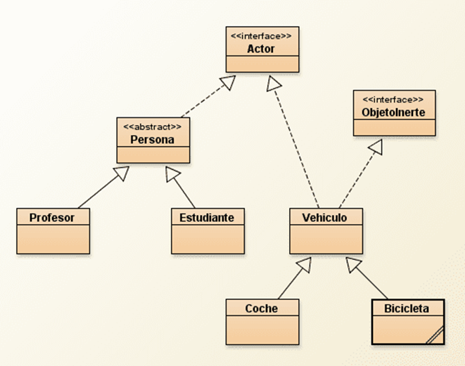
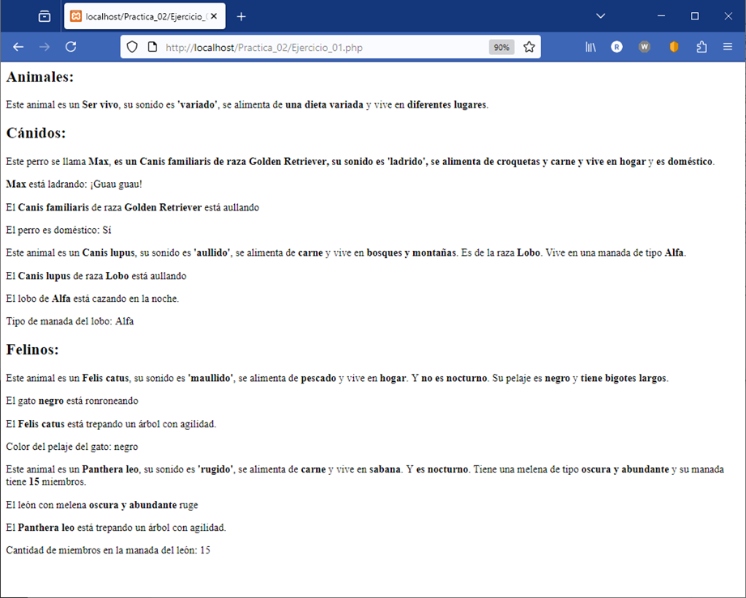
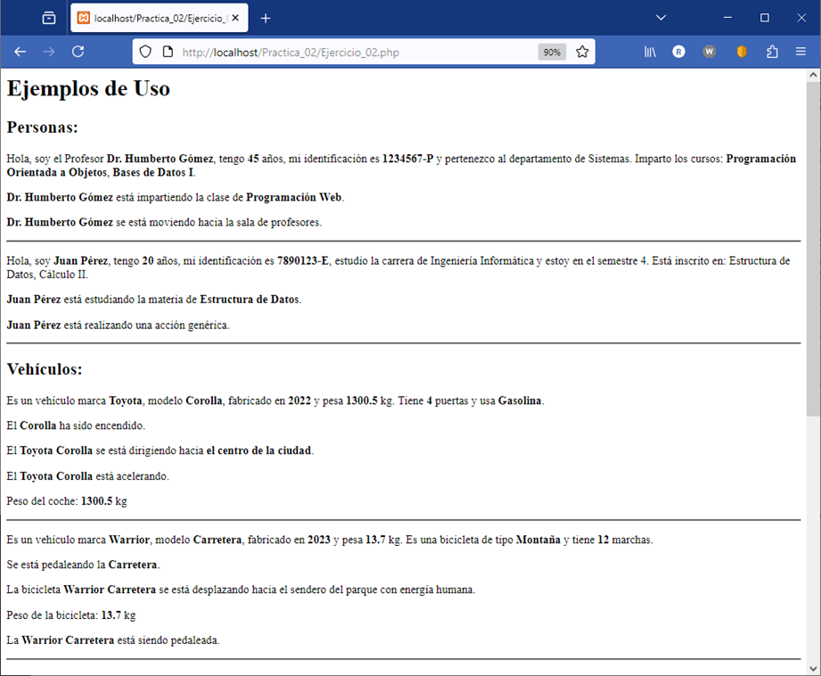
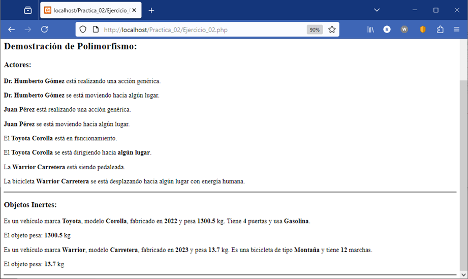

## Practica Nro. 2 POO en PHP

Realice la codificación de los siguientes problemas:
### 1.	Implementa el siguiente diagrama de clases:

Debe agregar atributos y métodos a las clases heredadas que considere necesarios.

### Resultado:

 

## 2.	Implemente el siguiente diagrama de clases:

Debe crear sus atributos y métodos que vea conveniente.

### Resultado:

