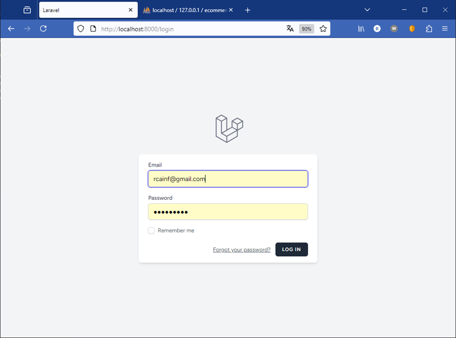
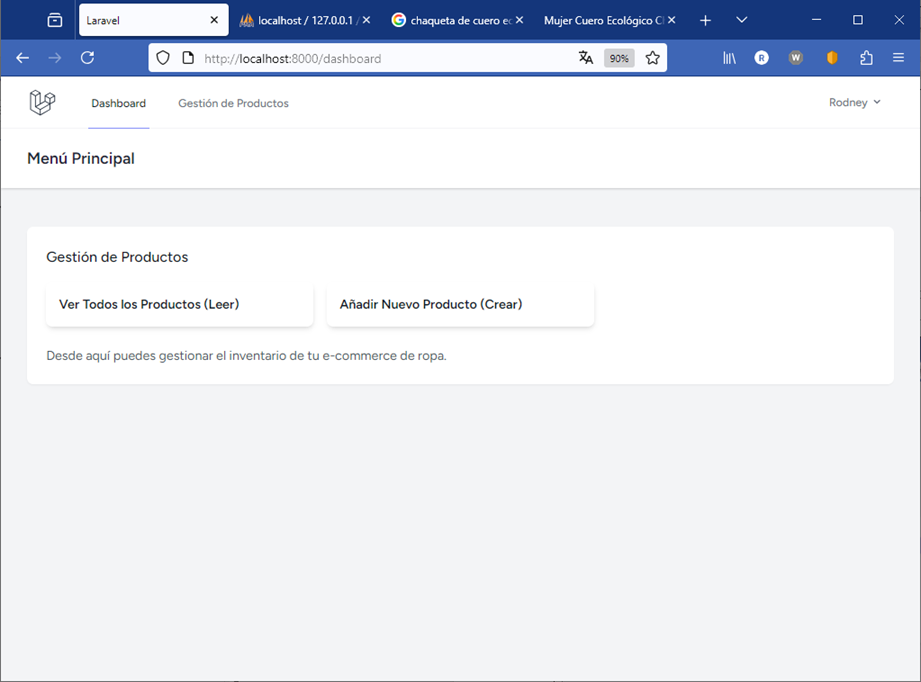
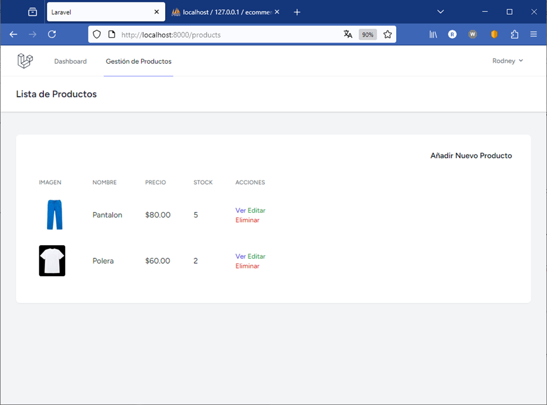
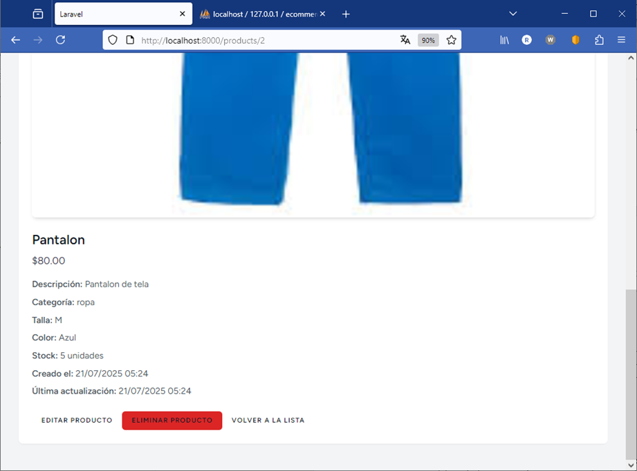

# Documentación del Proyecto: E-commerce de Ropa con CRUD en Laravel

Esta documentación proporciona una visión general del proyecto, su configuración, estructura y funcionalidades, diseñado para un desarrollador full-stack que trabaja con Laravel y PHP.

## 1. Introducción al Proyecto
Este proyecto es una aplicación web desarrollada con el framework Laravel que simula un sistema de gestión de productos para un e-commerce de ropa. Implementa las operaciones CRUD (Crear, Leer, Actualizar, Eliminar) completas sobre una tabla de base de datos de productos y cuenta con un sistema de autenticación de usuarios.

### Objetivo Principal: 
Demostrar la implementación de un CRUD robusto en Laravel, incluyendo autenticación, manejo de sesiones, middlewares y una interfaz de usuario navegable.

## 2. Requisitos del Sistema
Para ejecutar y desarrollar este proyecto, se necesita tener instalados los siguientes componentes:

PHP: Versión 8.1 o superior.

Composer: Gestor de paquetes de PHP.

Node.js y NPM/Yarn: Para compilar los assets de frontend (CSS y JavaScript) de Laravel Breeze.

MySQL: Base de datos.

Servidor Web: Apache o Nginx (o puedes usar el servidor de desarrollo de Laravel php artisan serve).

## 3. Configuración del Entorno de Desarrollo
Sigue estos pasos para poner en marcha el proyecto en tu entorno local:

Clonar el Repositorio (o Crear Proyecto si es nuevo):
Si estás comenzando desde cero, crea un nuevo proyecto Laravel:

```Bash

composer create-project laravel/laravel Practica_03
cd Practica_03
```

Configuración de la Base de Datos:

Crea una base de datos MySQL (por ejemplo, ecommerce_ropa).

Abre el archivo .env en la raíz del proyecto y configura las credenciales de tu base de datos:

Fragmento de código
```Bash
DB_CONNECTION=mysql
DB_HOST=127.0.0.1
DB_PORT=3306
DB_DATABASE=ecommerce_ropa # Tu nombre de base de datos
DB_USERNAME=tu_usuario_mysql # Tu usuario de MySQL
DB_PASSWORD=tu_contraseña_mysql # Tu contraseña de MySQL
```
Instala Dependencias de Laravel Breeze (Autenticación):

```Bash

composer require laravel/breeze --dev
php artisan breeze:install blade # Opcional: --dark para modo oscuro
```
Instala Dependencias de Frontend y Compilar Assets:

```Bash

npm install
npm run dev # Para desarrollo (vigila cambios), o npm run build para producción
```
Ejecutar Migraciones de Base de Datos:
Esto creará las tablas users (para autenticación) y products en tu base de datos.

```Bash

php artisan migrate
Crear Enlace Simbólico para Almacenamiento (Importante para imágenes):
```
Esto hace que las imágenes subidas sean accesibles públicamente.

```Bash

php artisan storage:link
```
Iniciar el Servidor de Desarrollo:

```Bash

php artisan serve
```
La aplicación estará disponible en http://127.0.0.1:8000.

## 4. Estructura del Proyecto y Componentes Clave
El proyecto sigue la estructura estándar de Laravel (MVC - Modelo-Vista-Controlador), con componentes adicionales para la autenticación y la gestión de assets.

### app/Models/Product.php:

    Modelo Eloquent para la tabla products. Define los atributos fillable para la asignación masiva.

### app/Http/Controllers/ProductController.php:

    Controlador de Recurso que maneja todas las operaciones CRUD para los productos (index, create, store, show, edit, update, destroy).

    Incluye validación de datos para las entradas del formulario y lógica para la subida y eliminación de imágenes.

### database/migrations/YYYY_MM_DD_HHMMSS_create_products_table.php:

    Migración que define la estructura de la tabla products en la base de datos (nombre, descripción, precio, categoría, talla, color, stock, imagen, etc.).

### routes/web.php:

    Define las rutas web de la aplicación.

    Incluye las rutas de autenticación de Laravel Breeze.

    Utiliza Route::resource('products', ProductController::class) para generar automáticamente las 7 rutas RESTful del CRUD para los productos.

    Las rutas de gestión de productos están protegidas por el middleware auth, asegurando que solo los usuarios autenticados puedan acceder a ellas.

### app/Http/Middleware/Authenticate.php:

    Middleware principal de autenticación de Laravel. Redirige a los usuarios no autenticados a la página de login. Laravel Breeze lo configura automáticamente.

### resources/views/:

    Contiene todas las vistas Blade de la aplicación.

### layouts/app.blade.php: 
    
    Layout base que incluye la barra de navegación, el menú responsivo y el slot para el contenido de las páginas.

### layouts/navigation.blade.php: 
    
    Componente de la barra de navegación superior, extendido para incluir un enlace a "Gestión de Productos".

### dashboard.blade.php: 
    
    Actúa como la vista principal/menú después del login, con enlaces directos a "Ver Todos los Productos" y "Añadir Nuevo Producto".

### products/: 
    
    Carpeta que contiene las vistas específicas para el CRUD de productos:

#### index.blade.php: Lista de todos los productos (operación READ).

#### create.blade.php: Formulario para crear un nuevo producto (operación CREATE).

#### edit.blade.php: Formulario para editar un producto existente (operación UPDATE).

#### show.blade.php: Vista de detalles de un producto específico (operación READ individual).

## 5. Funcionalidades Implementadas
### 5.1. Autenticación de Usuarios
Registro de Usuarios: Permite a nuevos usuarios crear una cuenta.

Login: Permite a los usuarios registrados acceder a la aplicación.

Manejo de Sesiones: Mantiene la sesión del usuario activa después del login.

Control de Acceso (Middleware auth): Protege las rutas de gestión de productos, asegurando que solo los usuarios autenticados puedan acceder a ellas. Si un usuario no autenticado intenta acceder a estas rutas, es redirigido a la página de login.

### 5.2. CRUD de Productos
Las siguientes operaciones se implementan para la gestión de la tabla products:

Crear (CREATE):

    Ruta: /products/create (GET para formulario), /products (POST para guardar).

    Vista: products/create.blade.php.

    Funcionalidad: Formulario para añadir un nuevo producto con campos como nombre, descripción, precio, categoría, talla, color, stock y una imagen. Incluye validación del lado del servidor.

Leer (READ):

    Listado de Productos:

    Ruta: /products (GET).

Vista: products/index.blade.php.

    Funcionalidad: Muestra una tabla con todos los productos existentes, incluyendo paginación y enlaces para ver, editar o eliminar cada producto.

    Detalle de un Producto:

    Ruta: /products/{id} (GET).

Vista: products/show.blade.php.

    Funcionalidad: Muestra toda la información detallada de un producto específico.

    Actualizar (UPDATE):

    Ruta: /products/{id}/edit (GET para formulario), /products/{id} (PUT/PATCH para guardar cambios).

Vista: products/edit.blade.php.

    Funcionalidad: Formulario pre-llenado con los datos actuales del producto para su edición. Permite actualizar la imagen o mantener la existente.

Eliminar (DELETE):

    Ruta: /products/{id} (DELETE).

    Funcionalidad: Elimina un producto de la base de datos y su imagen asociada del almacenamiento. Incluye una confirmación antes de la eliminación.

### 5.3. Navegación e Interfaz de Usuario
Login de Acceso: Punto de entrada inicial a la aplicación.

Vista Principal / Menú de Opciones (dashboard.blade.php): Actúa como el centro de control después de iniciar sesión, proporcionando enlaces claros a las operaciones principales de gestión de productos (Ver y Crear).

Barra de Navegación Global: Un enlace "Gestión de Productos" se ha añadido a la barra de navegación superior (accesible desde cualquier página autenticada) para una navegación rápida a la lista de productos.

Layout Base: Todas las vistas protegidas por autenticación utilizan un layout base (layouts/app.blade.php) para mantener una consistencia visual y de navegación.

## 6. Capturas

### Login


### Dashboard


### Listado de prouductos


### Detalle del producto
